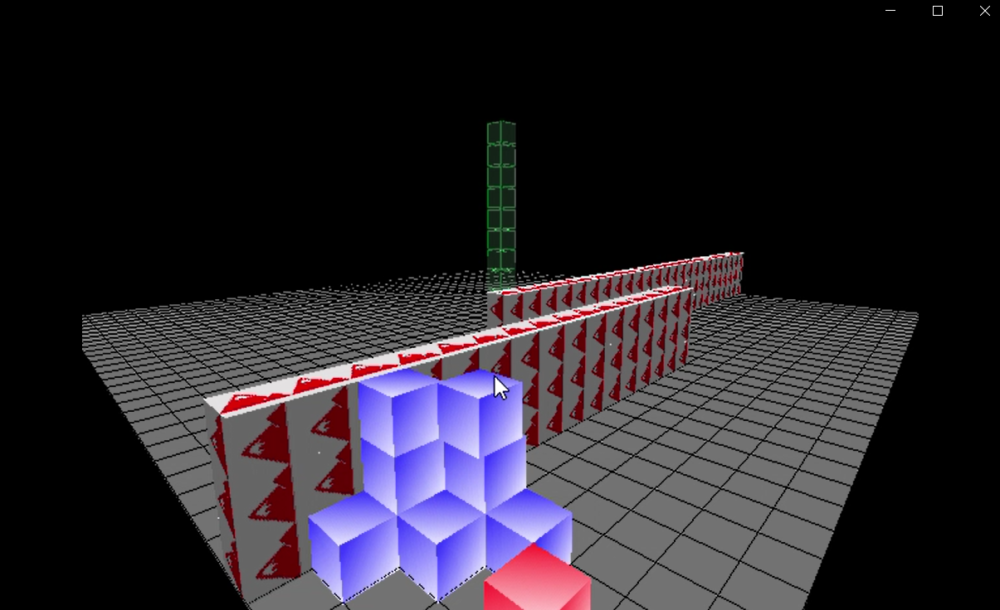

## Self-Reconfigurable modular robots
#### Project 1.2 @ BSc. Data Science and Knowledge engineering.

  A self-reconfigurable modular robot simulation. Capable of finding a path towards a given target location.
This project is particularly interesting due-to real-world possible applications: aid-providing robots for elderly homes, space exploration robots or rescuing robots.
The idea was to create an environment that allows to test and assess reinforcement/unsupervised learning algorithms.

## Requirements
* Each module can be moved whilst being connected to another module with at least one surface
  * A robot is a collection of interconnected modules.
* A robot should be capable of climbing over or going around obstacles

## Features
* Physics model: 
  * Gravity
  * friction
  * AABB collision
* Pathfinding: Allows modules to move towards target without violating the rules of robot operation
  * A-Star
* Reconfiguration: Once module(s) reach a target, it allows the modules to reconstruct into a given target configuration.
  * Markov Decision Processes
* Config creation: You can create your own map inside the "input" folder, defining the positions of :
  * obstacles
  * modules
  * target config

## Technologies used
* **Java**
* **LibGDX**
